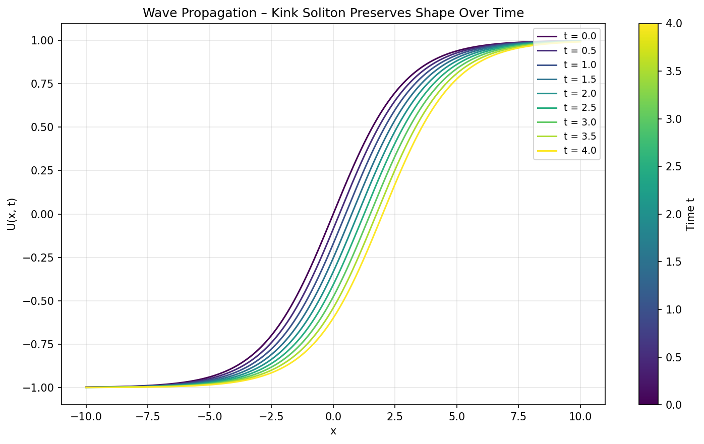
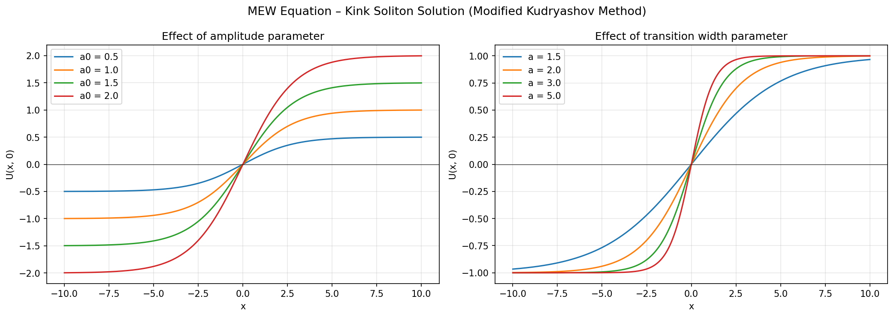

# MEW Equation – Analytical Solution via the Modified Kudryashov Method

Python implementation of the analytical solution derived in my M.Sc. thesis (Mersin University / University of Tübingen, 2026).

## The Equation

The Modified Equal Width (MEW) equation models nonlinear dispersive wave propagation:

    u_t + 3*alpha*u^2*u_x - beta*u_xxt = 0

It appears in plasma physics, fluid mechanics, and optical systems, and admits solitary wave solutions with both positive and negative amplitudes.

## Method

Finding analytical solutions to nonlinear PDEs is not straightforward. Not every method works for every equation, and choosing the right pairing matters. For the MEW equation, the Modified Kudryashov Method is a good fit: it handles the cubic nonlinearity well and produces closed-form traveling wave solutions.

The approach:

1. Apply a traveling wave transformation to reduce the PDE to an ODE
2. Use the balancing principle to determine the degree of the solution ansatz
3. Substitute the ansatz and solve the resulting algebraic system
4. Obtain the closed-form solution

## Result

The solution is a kink-type soliton:

    U(xi) = a0 * tanh( (ln(a)/2) * xi + (1/2) * ln(d) )

with xi = x - ct. What I found interesting when visualizing this: the wave preserves its shape as it propagates, which is the defining property of a soliton. Seeing the mathematical solution match the expected physical behavior was a good check.

## Usage

    pip install numpy matplotlib
    python mew_kudryashov.py

## References

Kudryashov, N. A. (2012). Analytical methods for nonlinear differential equations. Computers & Mathematics with Applications, 64(1), 12-18.

Wazwaz, A. M. (2016). Partial Differential Equations and Solitary Waves Theory. Springer.

Morrison, P. J., & Meiss, J. D. (1984). Scattering of regularized-long-wave solitary waves. Physica D, 11(3), 324-336.
